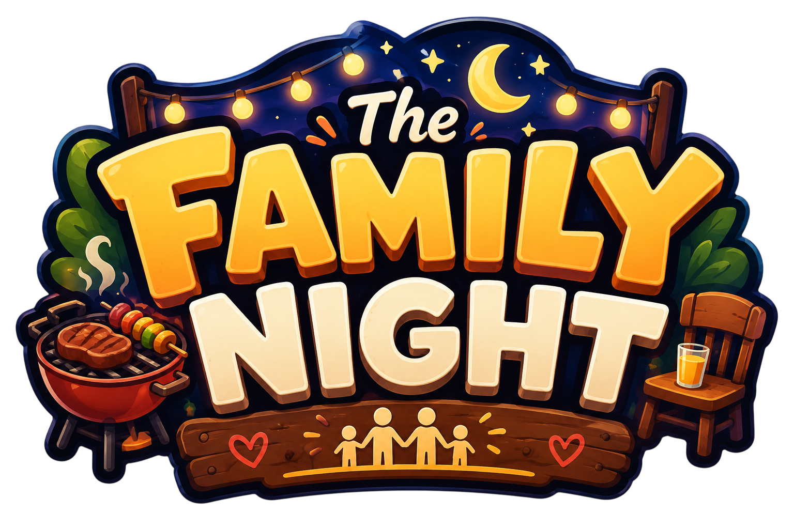

<p align="center">
  
</p>

# The Family Night

An arcade (Python) story game. Run it with:

```bash
pip install -r requirements.txt
python main.py              # fullscreen
python main.py --windowed   # windowed
```

The animated backgrounds are decoded with PyAV (`pip install av`). Without it
the game falls back to the still art. Settings > Graphics switches between
Quality (animated) and Performance (still, nothing decoded).

## Layout

```
main.py                 entry point: opens the window, shows the menu
game/
  config.py             canvas size, asset paths, tuning, palette, credits
  art/                  pure Pillow image work, no arcade and no GL context
    keying.py           key_out_white, solid_bbox, trim
    spritesheet.py      band_cuts, slice_sheet, align_frames, load_terry_frames
    widgets.py          wood_fill, add_drop_shadow, draw_plank, draw_disc, draw_card
  textures.py           the only place PIL images become arcade textures; caches by pixel size
  backdrop.py           scene backgrounds: looping video in quality mode, the still otherwise
  sprites.py            Terry: walk, jump and idle states
  ui.py                 Stage, MenuButton, CreditsButton, Card
  views.py              StageView, MenuView, GameView
tools/
  fetch_icons.py        downloads and renders the menu icons, development time only
assets/
  sprites/ backgrounds/ ui/ characters/ icons/
UI.py                   earlier standalone HUD prototype, not part of the package
```

Import from the module that owns it, for example:

```python
from game.art.keying import key_out_white, trim   # image helpers, no window needed
from game import textures                         # cached arcade textures
from game.ui import Stage, Card                   # menu widgets
```

## How the drawing works

**One canvas, any window.** Everything is positioned in a fixed 1280x720
canvas. `ui.Stage` maps that canvas onto the real window, letterboxing to keep
the aspect ratio. Widgets ask the stage for pixel sizes and build their art at
that size, so the menu is sharp at any resolution instead of being drawn small
and scaled up. `StageView.on_resize` re-lays everything out.

**Sprite frames.** Terry's art is drawn on white paper, so `art.keying` removes
the background on a ramp (fully clear above 250, fully solid below 214) which
avoids a white fringe on the anti-aliased outline. The movement sheet's drawings
overflow an even grid, so `art.spritesheet.band_cuts` finds the cut lines from
the blank space instead of assuming a cell size. All frames end up on one canvas
with their feet on the bottom edge so the sprite never jumps or resizes.

**Menu furniture** (planks, medallion, parchment) is drawn procedurally in
Pillow at 4x and downsampled. `textures` caches each result by pixel size.

## Icons

`assets/icons/*.png` are generated from [Bootstrap Icons](https://icons.getbootstrap.com/)
(MIT). Only the PNGs are kept; the SVG sources are downloaded, rendered and
discarded by the tool:

```bash
pip install -r requirements-dev.txt
python tools/fetch_icons.py
```

They are white silhouettes with an alpha channel, so the game tints one file for
both the resting and hovered colour. To change an icon, edit the `ICONS` table in
`tools/fetch_icons.py` and re-run it rather than editing a PNG. Attribution is in
`assets/icons/LICENSE.md`.

## Credits

Names shown in the in-game credits card live in `CREDITS_NAMES` in
`game/config.py`.
